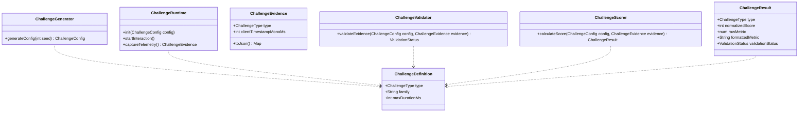

# Challenge Engine Abstraction Contract

## 1. Overview

The Challenge Engine decouples individual mini-game implementations from the match state machine, matchmaking queue, MMR settlement, and daily leaderboard infrastructure.

---

## 2. Abstraction Boundaries & Roles

### 2.1 `ChallengeDefinition`
Defines metadata, family categorization, base parameters, and physical timeouts for a challenge type.

### 2.2 `ChallengeGenerator`
A pure, deterministic function mapping a 32-bit `round_seed` into a concrete `ChallengeConfig` using **Mulberry32**.
- *Reaction:* Calculates `waitDelayMs` in $[1500, 4500]\text{ms}$.
- *Memory:* Generates non-repeating sequence of length $L$.
- *Precision:* Calculates normalized coordinates $(x_{\text{target}}, y_{\text{target}}) \in [0.18, 0.82]^2$.

### 2.3 `ChallengeRuntime`
The Flutter UI/presentation layer that takes a `ChallengeConfig`, renders the interactive canvas at 60/120 FPS, captures user input with monotonic clocks, and packages the interaction into `ChallengeEvidence`.

### 2.4 `ChallengeEvidence`
The polymorphic telemetry payload transmitted from client to server. Contains raw coordinates, frame presentation timestamps, touch event timestamps, and contact areas.

### 2.5 `ChallengeValidator` & `ChallengeScorer` (Server-Side)
- **Validator:** Verifies that touch timestamps obey physical human limits ($t_{\text{rx}} \ge 100\text{ ms}$) and coordinates lie within bounds.
- **Scorer:** Pure mathematical formula mapping raw metrics to a normalized integer score $S \in [0, 1000]$.

### 2.6 `ChallengeResult`
Encapsulates normalized score ($0-1000$), formatted user-facing metrics (e.g., `"214 ms"`, `"5 / 5"`, `"98.4%"`), and validation status.

---

## 3. Extensibility Guide: Adding New Challenges

Adding a new challenge category (e.g. *Timing*, *Spatial Reasoning*, *Estimation*) requires **zero modifications** to:
- Matchmaking queues
- 13-State Match Machine
- Realtime WebSocket protocols
- Elo settlement transactions
- Split Reveal Card layout

### Step-by-Step Extension
1. **Define Type & Config:** Add enum value to `ChallengeType` and create `NewChallengeConfig : ChallengeConfig`.
2. **Implement Generator:** Implement deterministic PRNG sequence mapping from 32-bit seed.
3. **Implement Runtime Widget:** Build Flutter canvas widget producing `NewChallengeEvidence`.
4. **Implement Server Scorer:** Add corresponding `calculateNewChallengeScore()` on Edge Function.
