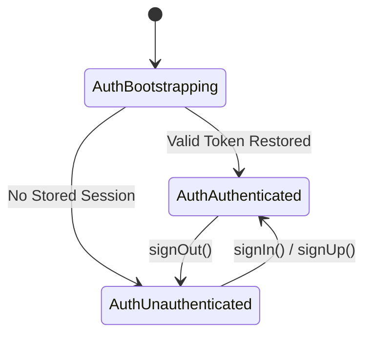

# Phase 1H — Authentication, App Shell & User Identity Report

**Status:** COMPLETE  
**Supabase Project:** `better-than-you` (`zlcqkmzwwydjodbzhiyn`)  
**Region:** `eu-central-1` (Frankfurt)  

---

## 1. Overview

Phase 1H establishes the authenticated application shell, domain-level authentication abstractions, session lifecycle management, and profile provisioning.

- **Domain-Level Auth Abstraction:** All authentication operations are mediated by `AuthRepository` (`LocalAuthRepository` for unit/offline testing and `SupabaseAuthRepository` for live Supabase Auth).
- **Explicit Auth State Model:** Replaced scattered boolean checks with sealed state hierarchy `AppAuthState` (`AuthBootstrapping`, `AuthUnauthenticated`, `AuthAuthenticated`).
- **Session Bootstrapping:** Startup restores existing tokens via `BootstrapScreen` before determining the route, avoiding screen flashes.
- **Server-Side Profile Provisioning:** Respects the canonical PostgreSQL `handle_new_user()` trigger on `auth.users` without redundant client-side inserts.
- **Authenticated App Shell:** Persistent 3-destination navigation shell (`ARENA`, `DAILY`, `PROFILE`) with route guards.

---

## 2. Authentication Architecture & State Lifecycle

### 2.1 Domain Layer
- **`AuthRepository` (`lib/domain/auth/auth_repository.dart`):** Interface for `signIn`, `signUp`, `signOut`, `restoreSession`, `getProfile`, and `updateProfile`.
- **`AuthController` (`lib/domain/auth/auth_controller.dart`):** `ChangeNotifier` providing reactive authentication state.
- **`PlayerProfile` (`lib/domain/profile/player_profile.dart`):** Encapsulates username, display name, MMR, rank division, match record, and attribute averages.

### 2.2 Presentation & Shell
- **`BootstrapScreen` (`lib/presentation/auth/bootstrap_screen.dart`):** Startup gate resolving session and routing to `/home` or `/login`.
- **`LoginScreen` (`lib/presentation/auth/login_screen.dart`):** Dark geometric login interface with input validation and user-facing error translation.
- **`RegisterScreen` (`lib/presentation/auth/register_screen.dart`):** Registration screen enforcing username length (3–20 chars) and password confirmation.
- **`ProfileScreen` (`lib/presentation/profile/profile_screen.dart`):** Displays avatar, rank badge, MMR, match record, and allows updating display name while respecting backend triggers.
- **`AppShell` (`lib/presentation/shell/app_shell.dart`):** Bottom navigation controller hosting Arena (Home), Daily, and Profile destinations.

---

## 3. Route Protection & Security Boundaries

- **Route Guards:** `AppRouter.generateRoute` inspects `authRepository.currentState`. Unauthenticated attempts to access `/home`, `/match`, `/daily`, `/daily-leaderboard`, or `/profile` redirect to `/login`.
- **Competitive Stat Protection:** Confirmed that `mmr`, `wins`, `losses`, `draws`, `matches_played`, and `rank_tier` cannot be modified by client requests (protected by migration `20260826000008` trigger).
- **Public Keys Only:** Client strictly uses publishable Supabase anon key; no service-role secrets are included.

---

## 4. Verification & Testing

### 4.1 Automated Test Suite
- **Auth Unit Tests (`test/unit/auth_repository_test.dart`):** Verifies state transitions, invalid credential rejection, username length checks, and profile display name updates.
- **Auth Widget Tests (`test/widget/auth_widget_test.dart`):** Tests form validation, login flows, registration flows, and bootstrap redirection.
- **Profile & AppShell Widget Tests (`test/widget/profile_widget_test.dart`):** Tests profile card rendering, logout navigation reset, and tab switching.
- **Existing Suites:** All Phase 1B–1G unit and widget tests continue passing.
- **Results:** **93 / 93 PASSED** (100% clean).
- **Static Analysis:** `flutter analyze` completed with **0 issues**.

---

## 5. Known Limitations
- Social OAuth sign-in providers (Apple / Google) can be added in a future phase without modifying the `AuthRepository` interface.
